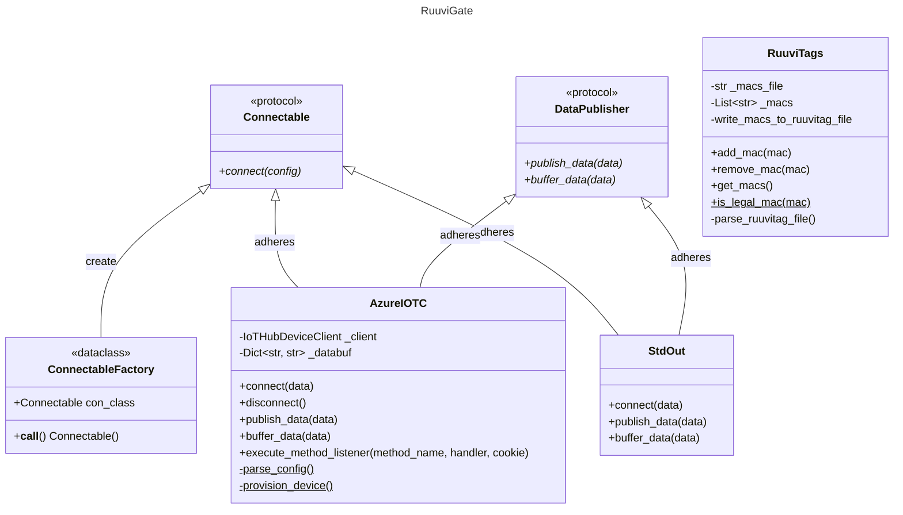

```mermaid
---
title: RuuviGate
---
classDiagram

    class Connectable {
        <<protocol>>
        +connect(config)*
    }

    class DataPublisher {
        <<protocol>>
       +publish_data(data)*
       +buffer_data(data)*
    }

    class ConnectableFactory {
        <<dataclass>>
        +Connectable con_class
        +__call__() Connectable()
    }

    class AzureIOTC {
        -IoTHubDeviceClient _client
        -Dict~str, str~ _databuf
        +connect(data)
        +disconnect()
        +publish_data(data)
        +buffer_data(data)
        +execute_method_listener(method_name, handler, cookie)
        -parse_config()$
        -provision_device()$
    }

    class StdOut {
        +connect(data)
        +publish_data(data)
        +buffer_data(data)
    }

    class RuuviTags {
        -str _macs_file
        -List~str~ _macs
        +add_mac(mac)
        +remove_mac(mac)
        +get_macs()
        +is_legal_mac(mac)$
        -parse_ruuvitag_file()
        -write_macs_to_ruuvitag_file

    }

    Connectable <|-- ConnectableFactory : create
    Connectable <|-- AzureIOTC : adheres
    Connectable <|-- StdOut : adheres
    DataPublisher <|-- AzureIOTC : adheres
    DataPublisher <|-- StdOut : adheres
```
